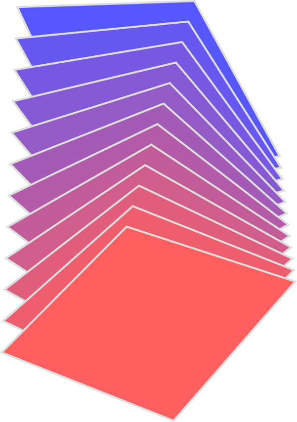
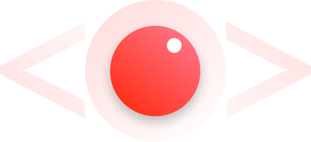

<h1 style="text-align: center;">CodEd - Edutech</h1>
<h3 style="text-align: center;">The perfect platform to learn code</h3>

<table style="width:100%;border: 2px solid white;text-align: center;">
  <tr>
    <td></td>
    <td></td>
  </tr>
</table>

## Unique features we offer

Our complete product revolutionises the code learning process, by providing everything a curious mind can need on a single platform

- <h3>Code Play:</h3> Code will play as per the instructors typing.
- <h3>Audio Visual touch:</h3> The instructors audio and video will be displayed along with the typed code.
- <h3>In Built IDE:</h3> Our In-Built IDE helps the student jump into code with the instructor and play with it to give learning a new touch.
- <h3>Playground:</h3> Our code playground with a wide range of language support.
